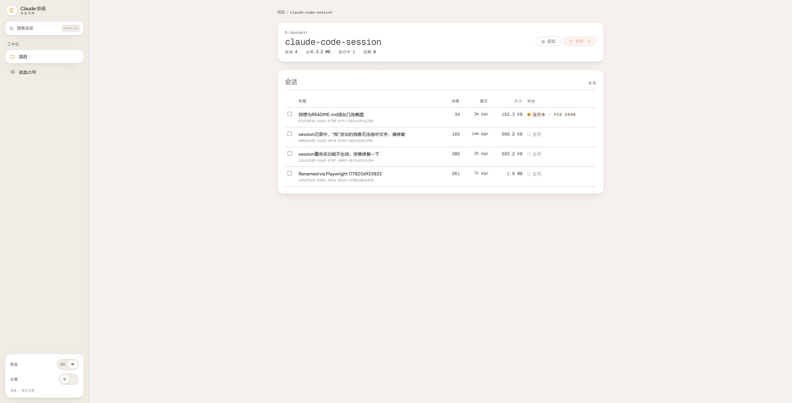
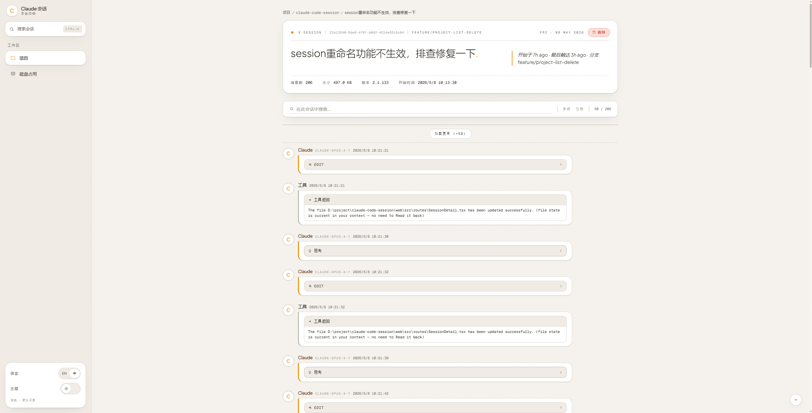
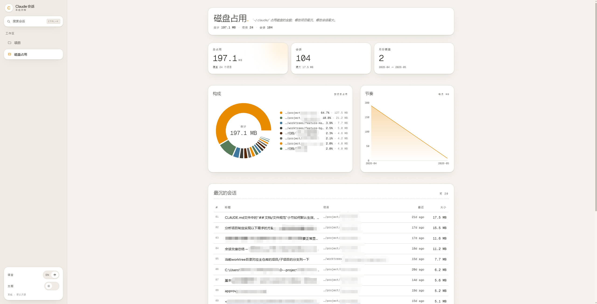

# Claude Code Session Manager

A local web UI to view and clean up Claude Code session history stored under `~/.claude/`.

> **Read-only on disk by default.** The only write the server performs is when you explicitly click *Delete* in the UI. Active sessions (with a live PID or recent activity) are skipped automatically.

## Screenshots

> See [`docs/screenshots/README.md`](docs/screenshots/README.md) for the capture recipe (Windows / macOS / Linux) if you want to refresh these.

<p align="center">
  <a href="docs/screenshots/project-detail.png"></a>
  <br><sub><b>Project detail</b> — sessions in one project, multi-select, status badges</sub>
</p>

<p align="center">
  <a href="docs/screenshots/session-detail.png"></a>
  <br><sub><b>Session detail</b> — full message timeline with search highlight</sub>
</p>

<p align="center">
  <a href="docs/screenshots/disk-usage.png"></a>
  <br><sub><b>Disk usage</b> — pie + monthly bars + top-20 table</sub>
</p>

## Features

| Page | What you can do |
|---|---|
| **Projects** (`/`) | See every Claude Code project (one per `cwd`) with session count, total bytes on disk, last-activity time. |
| **Project detail** (`/projects/:id`) | Browse all sessions in one project. Multi-select + cascade-delete. Each row shows title, message count, byte breakdown, and a status badge (`live · pid N` / `recently active` / `idle`). Inline rename appends a `custom-title` record to the session's `.jsonl` (refused while a live PID owns the session). *Open folder* reveals the project's working directory in the OS file manager (Explorer / Finder / `xdg-open`). |
| **Session detail** (`/projects/:id/sessions/:sid`) | Full message timeline: text, tool calls (collapsible), tool results, thinking blocks. Sticky search bar with client-side highlight. Toggle to show or hide system messages (`<command-name>` etc.). Inline *Delete* (top-right of the masthead) removes the current session and returns to the project list. |
| **Project memory** (`/projects/:id/memory`) | Two-pane reader for `~/.claude/projects/<encoded-cwd>/memory/`: searchable file list (sort by index / recent / name / size) on the left, rendered Markdown on the right, with `MEMORY.md` pinned as the index. |
| **Disk usage** (`/disk`) | Pie chart by project, monthly bar chart, top-20 largest sessions with deep links. |
| **Cross-session search** (⌘K / Ctrl+K) | Global modal that streams matches from every project as you type. Searches text, tool calls, and thinking blocks; each result deep-links into the session at the matched message. |

The persistent sidebar carries the search trigger plus locale (zh / en) and theme (light / dark) toggles. The HTTP listener exposes the same content as a single SPA, so deep links like `/projects/:id/sessions/:sid?q=foo` are sharable between browser tabs on the same machine.

## Quick start

Requires **Node 22+** (Node 24 recommended).

```bash
git clone <this-repo>
cd claude-code-session
npm install
npm run dev
```

Open <http://localhost:5173>.

| Script | Effect |
|---|---|
| `npm run dev` | Concurrent backend (`:3131`) + Vite dev server (`:5173`) with HMR. Vite proxies `/api/*` to the backend. |
| `npm run build` | Builds the SPA to `dist/`. |
| `npm run start` | Single-process production mode: backend on `:3131` serves `dist/` + the API. |
| `npm run typecheck` | `tsc -b` over both server and web projects. |

The HTTP server binds to `127.0.0.1` only — never reachable from the LAN.
Default port is `3131`. If it's busy, the server tries `3132 … 3140` and prints the actual port to stdout.

## What gets deleted

Claude Code stores session data across **five** locations under `~/.claude/`. Deleting a session here cleans up all of them in one shot:

| Path | Contents |
|---|---|
| `projects/<encoded-cwd>/<sessionId>.jsonl` | Main message stream |
| `projects/<encoded-cwd>/<sessionId>/` | Sub-agent threads + per-session memory |
| `file-history/<sessionId>/` | Snapshots of every file Claude edited in this session (often the largest contributor) |
| `session-env/<sessionId>/` | Environment snapshots |
| `history.jsonl` | Lines whose `sessionId` matches are stripped via atomic rewrite (backup → tmp → rename) |
| `sessions/<pid>.json` | Removed only when the PID has actually exited |

**Safety rails (a session is *skipped*, not deleted, when):**
- Its `sessionId` appears in a `sessions/<pid>.json` file whose PID is alive (`process.kill(pid, 0)` on Unix, `tasklist` on Windows).
- Its `.jsonl` was modified within the last 5 minutes (could still be in use after a `/clear` even if the PID file points elsewhere).
- The decoded path escapes `~/.claude/` (path-traversal guard).
- The session id contains `/`, `\`, `..`, or starts with `.`.

The UI's confirmation dialog shows the exact files and bytes that will be removed *and* lists which selections will be skipped and why.

## Architecture

```
shared/         Wire types + constants imported by BOTH server and web.
server/         Hono + @hono/node-server backend, all filesystem operations.
  lib/          claude-paths, encode-cwd, scan, parse-jsonl, load-session,
                load-memory, rename-session, search-all, search-session,
                active-sessions, delete, disk-usage, fs-size, safe-id,
                system-tags, port, …
  routes/       projects, sessions, disk, search
web/            React 19 + Vite + Tailwind v4 SPA.
  src/routes/   ProjectsList, ProjectDetail, SessionDetail,
                ProjectMemory, DiskUsage (lazy)
  src/components  Sidebar, SearchModal, PageHeader, MessageBubble,
                  ToolBlock, DeleteDialog, HighlightedText, …
  src/lib       api, query-keys, i18n, theme, hotkeys, format
docs/spec/      Design notes (start here before refactoring).
docs/acceptance/  Per-feature e2e plans, round evidence, retrospectives.
```

### HTTP API

| Method | Path | Purpose |
|---|---|---|
| `GET` | `/api/health` | `claudeRoot`, platform, pid — used by the UI's empty-state banner. |
| `GET` | `/api/projects` | Project summaries (one per `cwd`). |
| `GET` | `/api/projects/:id/sessions` | Session list for a project. |
| `GET` | `/api/projects/:id/memory` | Memory file index + content for the two-pane reader. |
| `GET` | `/api/sessions/:projectId/:sessionId` | Full parsed message timeline. |
| `PATCH` | `/api/sessions/:projectId/:sessionId` | Rename a session by appending a `custom-title` record to the `.jsonl`. |
| `DELETE` | `/api/sessions` | Cascade-delete one or more sessions; CSRF-checked via `Origin`. |
| `GET` | `/api/disk-usage` | Per-project totals + monthly buckets + top-N sessions. |
| `GET` | `/api/search?q=...` | NDJSON stream of matches across every project. |

| Layer | Tech |
|---|---|
| Backend runtime | Node 22+ + `tsx` (TS direct execution) |
| HTTP | Hono + `@hono/node-server` |
| Frontend | React 19 + Vite 6 + Tailwind v4 + TanStack Query + React Router 7 |
| Charts | Recharts (lazy-loaded only on `/disk`) |

The DiskUsage page is code-split, so the initial bundle is **~124 KB gzipped**. Recharts (~80 KB gzipped) loads on demand when you navigate to `/disk`.

## Cross-platform

| OS | `~/.claude/` resolves to | `projects/` subdir naming |
|---|---|---|
| macOS / Linux | `$HOME/.claude/` | `/foo/bar` → `-foo-bar` |
| Windows | `C:\Users\<you>\.claude\` | `C:\foo\bar` → `C--foo-bar` |

Decoding a project id back to a real path uses each session's own `cwd` field (recorded inside the `.jsonl`) when available; otherwise it falls back to a heuristic decode and stat-checks the result. Projects whose decoded path no longer exists on disk are flagged in the UI.

## Troubleshooting

**Port 3131 busy.** The server auto-picks the next free port up to 3140 and prints it on startup. Look at the `[server] listening on http://127.0.0.1:<port>` line.

**`Claude root .../.claude doesn't exist`.** The Projects page shows an amber banner with the resolved path. Either Claude Code hasn't been run on this machine, or `$HOME` resolves somewhere unexpected. Check `node -e 'console.log(require("os").homedir())'`.

**Delete dialog says my current session is skipped.** Expected — your live Claude Code process has its `sessionId` registered in `~/.claude/sessions/<pid>.json` *or* the `.jsonl` was just modified. Wait 5+ minutes after closing Claude, then try again.

**`history.jsonl.bak-<timestamp>` left behind.** Means the swap rename failed mid-flight. The original is intact (the backup *is* the original). Compare both files and either `mv backup history.jsonl` to restore or `rm` the backup if the new one looks fine.

**Windows: delete fails with `EBUSY`.** Some Windows AV / indexer can hold a lock on `.jsonl` files. Close any text editors that have the file open and retry.

**Browser can't reach the server.** The bind is `127.0.0.1`, not `0.0.0.0`. Make sure you're using `http://localhost:3131` from the same machine — not a LAN IP.

## Security model

This tool is intended for a single user on their own machine. It is *not* hardened for multi-user / shared environments.

- The HTTP listener binds to `127.0.0.1` only.
- Mutating endpoints (`DELETE /api/sessions`, `PATCH /api/sessions/:projectId/:sessionId`) require an `Origin` header matching `http(s)://(localhost|127.0.0.1):*`. This blocks other web pages your browser opens from triggering writes via CSRF, but cannot stop another local process running as the same user.
- All filesystem paths are validated with `path.resolve(...).startsWith(claudeRoot)` (Windows-aware case-folded) before any read or write.
- IDs from URL params are rejected if they contain `/`, `\`, `..`, or start with `.`.
- The cross-session search endpoint streams NDJSON and aborts when the client disconnects, so a closed browser tab stops the scan immediately.

There is no authentication. If you're paranoid, run behind a firewall rule or only invoke the tool when needed.

## Project layout

See [`docs/spec/session-manager-design.md`](docs/spec/session-manager-design.md) for the full design rationale (data model, routing decisions, cross-platform strategy, future work).

## License

MIT — see [LICENSE](LICENSE).
