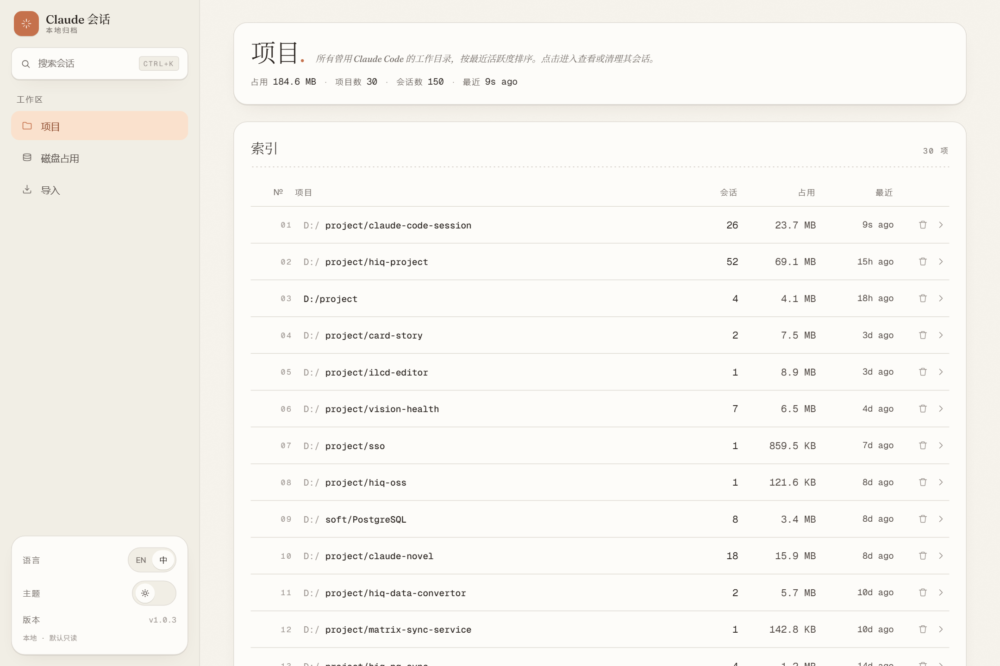
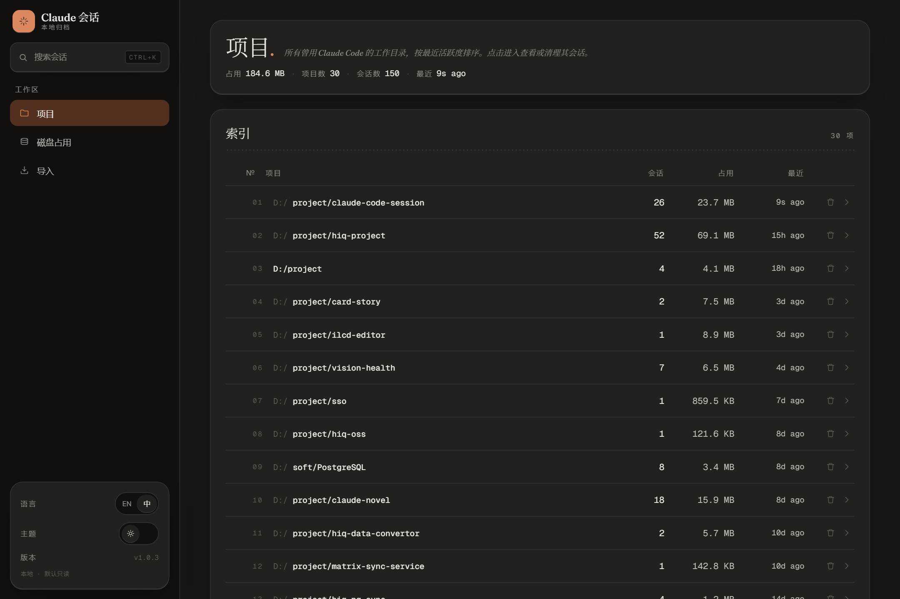
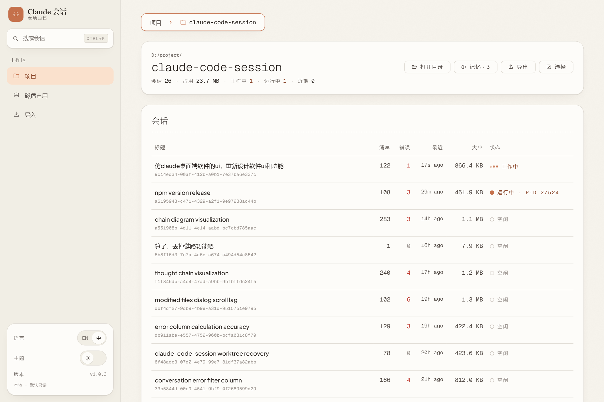
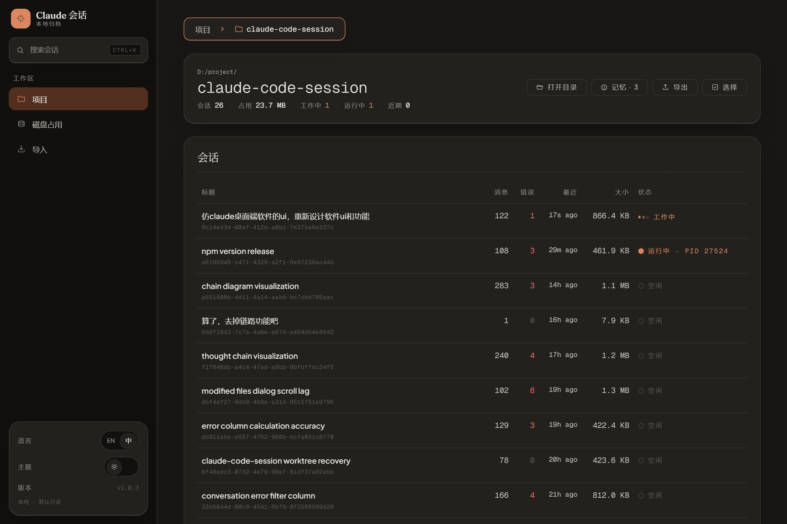
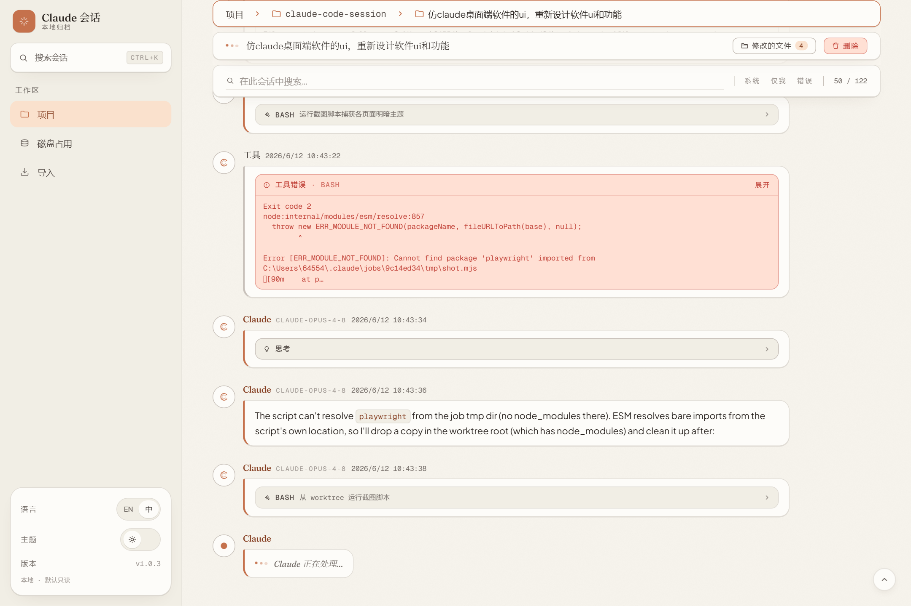
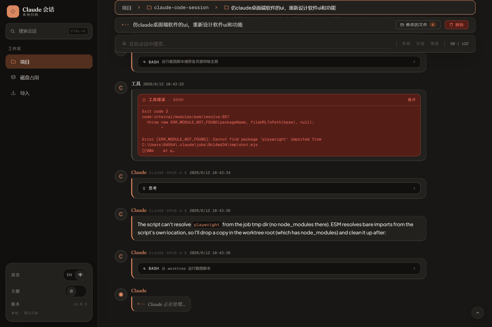

# Round 1 — 仿 Claude 桌面端改版验证

环境：Windows 11 / Node v22.13.0 / 生产构建（`npm run build` + `npm run start`，单进程读真实 `~/.claude`，端口 3131）/ Playwright chromium，viewport 1440×960 @1.5x。截图脚本 [`scripts/shot.mjs`](scripts/shot.mjs)。

## 静态检查

| 检查 | 结果 | 证据 |
|---|---|---|
| `npm run typecheck` | PASS | tsc -b，0 error |
| `npm run build` | PASS | 34s；Fraunces woff2 正常打包；`index-*.css` 编译通过 |
| `npm test` | PASS | 9 files / 61 tests 全绿（server 安全网未受表现层改动影响）|

## 视觉证据

### Home — 项目列表

暖米白 canvas；侧栏实心 coral 品牌块 + Claude 风 sunburst + 衬线 wordmark；活跃 nav「项目」为 coral-soft 柔色高亮；masthead 衬线「项目.」标题。暗色为 Claude 暖炭灰（#262624 系），accent 提亮的 coral。

| Light | Dark |
|---|---|
|  |  |

### Project — 会话列表

ledger 表全程跟随 token 换肤（coral 序号 / chevron / hover ribbon）。

| Light | Dark |
|---|---|
|  |  |

### Session — 聊天式会话详情

聊天时间线：用户消息暖奶油卡（贴近 Claude 中性人类气泡）、助手消息 coral sunburst 头像 + 衬线 coral 角色名 + coral 左缘卡片；底部 live「Claude 正在生成…」coral 脉冲。

| Light | Dark |
|---|---|
|  |  |

## 结论

四个必还原特征（暖米白 / coral / 衬线标题 / 聊天卡片）在 light + dark 两套主题、三类页面下均按预期渲染；静态检查无回归。全绿。
