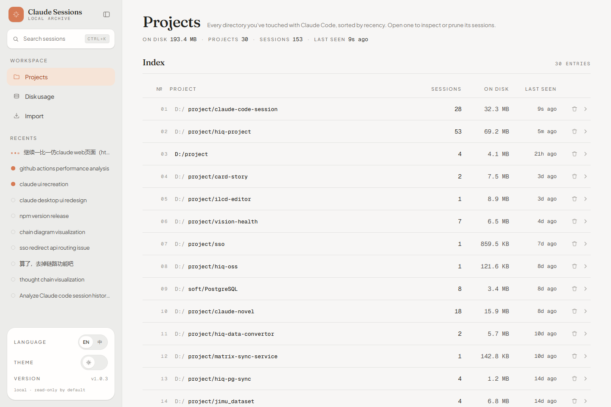
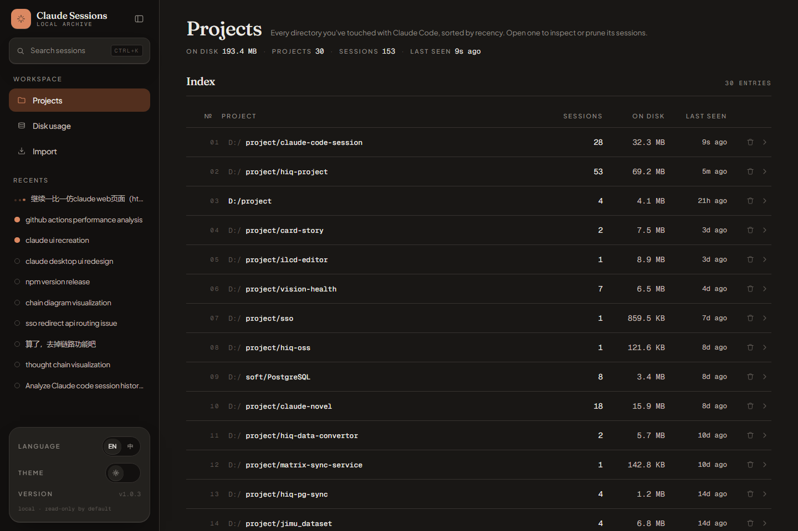
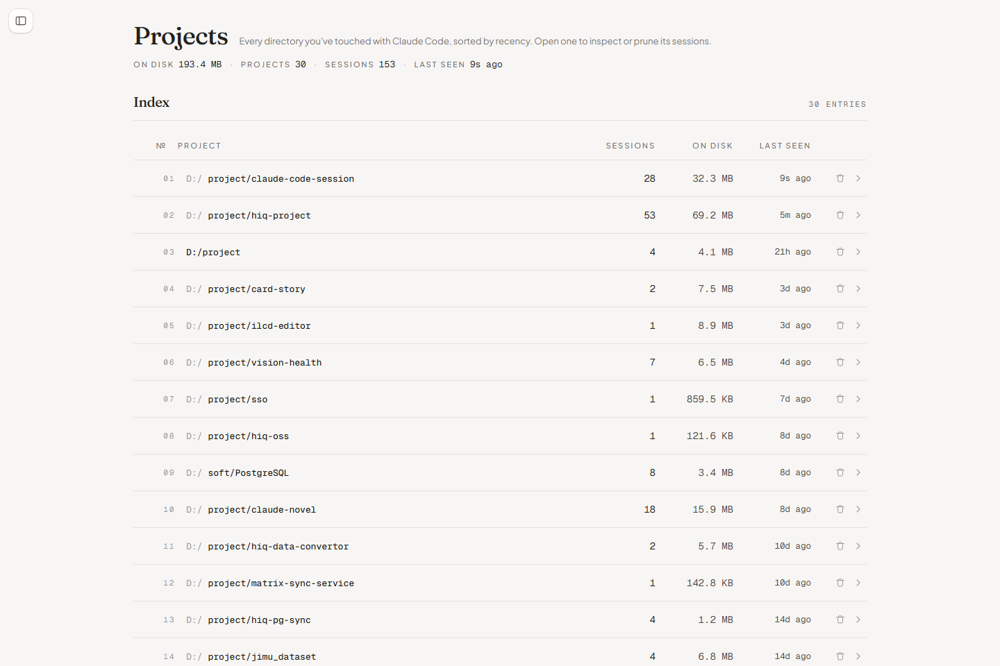
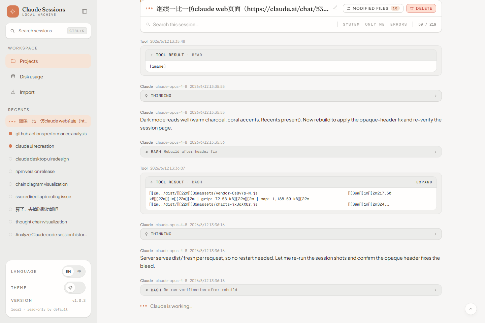
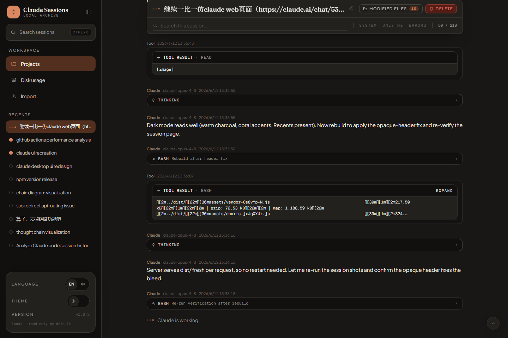
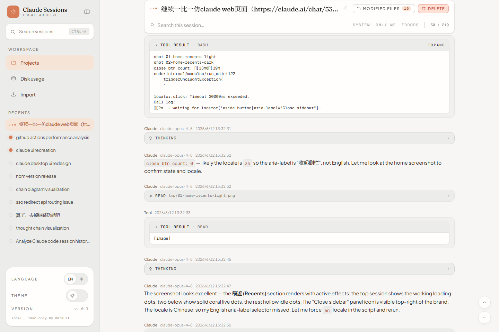

# Round 1 —— 全绿

环境：worktree `worktree-claude-web-sidebar-recents`，生产构建 + `npm run start`（端口 3132，读真实 `~/.claude`，30 个项目 / 153 个会话）。

## 自动化

```
$ npm run typecheck      # tsc -b，0 error                         → PASS (TC1)
$ npm test               # vitest：9 files / 61 tests passed       → PASS (TC2)
$ npm run build          # vite build，14s/9s 两次均成功            → PASS (TC3)
```

## 接口（TC4）

```
$ curl -s 'http://127.0.0.1:3132/api/sessions/recent?limit=5'
count: 5
  D--project-claude-code | live=True  working=True  recent=True  | 继续一比一仿claude web页面…
  D--project-claude-code | live=True  working=False recent=False | claude ui recreation
  D--project-hiq-project | live=False working=False recent=False | github actions performance analysis
  D--project-claude-code | live=False working=False recent=False | claude desktop ui redesign
  D--project-claude-code | live=False working=False recent=False | npm version release
```

跨项目按 lastAt 降序；当前正在运行的会话正确标到 `working=True`，另一存活进程标到 `live=True`，其余 idle。

## 真机截图

| 截图 | 验证点 |
|---|---|
|  | TC5 light：侧栏 Recents 列表 + 顶部会话三点行进（working）/ 实心点（live）/ 空心点（idle） |
|  | TC5 dark：暖炭灰下 Recents + 活跃点 |
|  | TC6：Close sidebar 后侧栏隐藏、主区占满、左上浮出再展开 handle |
|  | TC7/TC9 light：精简 chat header（状态+标题+Modified files+Delete）+ 搜索过滤行 + 居中消息流 + “Claude is working…” 尾行 |
|  | TC7 dark：同上，暗色 |
|  | TC8：滚动后不透明 sticky header 钉住、标题常驻、无透字 |

## 备注

- 初版 sticky header 用 `topbar-glass`（半透明）时，钉住后消息文字会透到搜索/开关行影响可读性 → 改为不透明 `--color-surface`，本轮截图已是修正后。
- 截图首轮发现 C 盘 100% 满导致写 0 字节，OUT 改落 D 盘后正常（与本特性无关，记录备查）。
