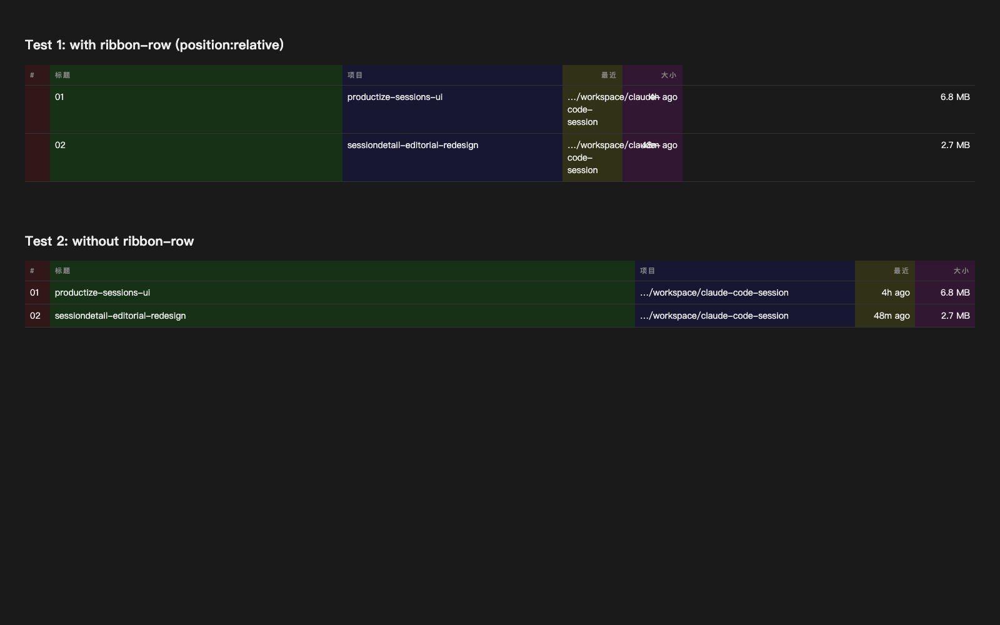

# Disk Usage 表格对齐 — 验收报告

验收日期：2026-05-04
环境：macOS Darwin 22.6.0、Node 22+、Chrome headless（dev server `http://127.0.0.1:5173`）

## 总览

| 项 | 结果 |
|---|---|
| `npm run typecheck` | ✅ 全绿 |
| Disk 页表格表头/数据列对齐 | ✅ |
| ProjectsList ribbon hover 视觉无回归 | ✅ |
| ProjectDetail 表格列对齐无回归 | ✅ |

## 现象

`/disk` 页"最沉的会话"表格中，**表头**与**数据**列在 X 轴上不对齐：

- "项目"表头在列左，但数据 `…/workspace/claude-code-session` 出现在列中右；
- "最近"、"大小"两列右对齐头/数据右边沿不重合。

证据：[`round-1/01-disk-before-misaligned.png`](round-1/01-disk-before-misaligned.png)

## 根因

`web/src/index.css` 的 `.ribbon-row` 给 `<tr>` 加了 `position: relative; isolation: isolate`，用于挂 `::before` 画 hover 时左侧 2px 高亮带。

在 Chrome / WebKit 下，**`<tr>` 上的 `position: relative` 会破坏 `table-layout: fixed` 的列宽继承**：`<colgroup>` 指定的列宽只对 `<thead>` 生效，`<tbody>` 的 `<tr>` 退化成自行计算列宽，结果两边列边沿错位。

### 隔离复现（不依赖项目代码）

[`scripts/isolated-repro.html`](scripts/isolated-repro.html) 是一份只用纯 HTML/CSS 的最小复现：同一份 `colgroup` 配两份 `<tbody>`，一份 `<tr class="ribbon-row">`，一份不加。结果（彩色背景为 `<col>` 显式高亮）：



- **Test 1 (有 ribbon-row)**：彩色 `<col>` 块只覆盖到第 5 列宽，"6.8 MB"漏出在最后；说明数据行的列宽 ≠ 表头列宽。
- **Test 2 (无 ribbon-row)**：彩色块全幅覆盖，对齐完美。

差异**仅来自** `tr.ribbon-row { position: relative }` 一行 CSS。

## 修复

`web/src/index.css`：把 ribbon CSS 拆成两个分支：

- **非 `<tr>` 场景**（`ProjectsList` 的 `<Link>` grid）：保留原 `position: relative` on container + `::before`，行为不变；
- **`<tr>` 场景**：把 `position: relative` 挪到 `tr > :first-child`（第一个 `<td>`），`::before` 也挂到那里。`<tr>` 自身不再带定位，`table-layout: fixed` 正常工作。

`web/src/routes/DiskUsage.tsx`：同步加 `table-fixed` + `<colgroup>` 显式声明 5 列宽（NUM 40px / TITLE 弹性 / PROJECT 352px / LAST 96px / SIZE 96px），把原 `<td>` 直挂的 `truncate / max-w-xs / max-w-md` 移到内部 `<a>` 上，跟 `<colgroup>` 边界一起兜底。

## 验证

### 1. Disk 页表头/数据对齐

[`round-1/03-disk-after-aligned.png`](round-1/03-disk-after-aligned.png)

肉眼可见 5 列表头和数据 X 轴严格对齐：左 3 列左边沿一致、右 2 列右边沿一致。

### 2. ProjectsList ribbon hover（非 tr 场景）无回归

[`round-1/04-projects-list-no-regression.png`](round-1/04-projects-list-no-regression.png)

`<Link>` grid 卡片列表渲染正常，列标头对齐，ribbon 的 ::before 仍在容器层（hover 时 2px 橙色带从左滑入；静态截图中不可见，已通过 `:not(tr)` 分支保留原行为）。

### 3. ProjectDetail 表格（同样含 `tr.ribbon-row`）无回归

[`round-1/05-project-detail-no-regression.png`](round-1/05-project-detail-no-regression.png)

会话列表表格的列对齐良好。

### 4. typecheck

```
$ npm run typecheck
> tsc -b
(无输出 = 全绿)
```

## 修改文件

- `web/src/index.css` — `.ribbon-row` CSS 拆 `:not(tr)` 与 `tr.ribbon-row > :first-child` 两支
- `web/src/routes/DiskUsage.tsx` — 加 `table-fixed` + `<colgroup>`；`truncate` / 宽度约束从 `<td>` 挪到内部 `<a>`
